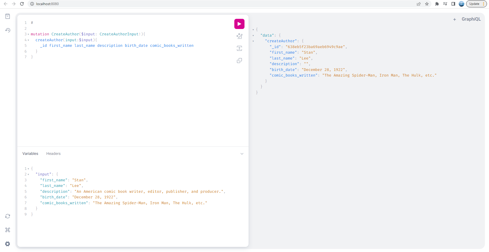
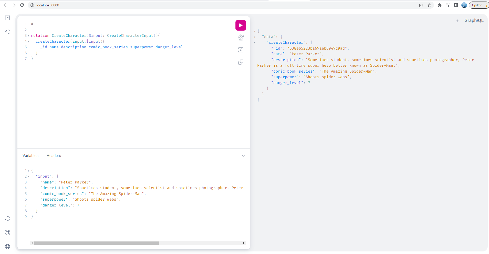
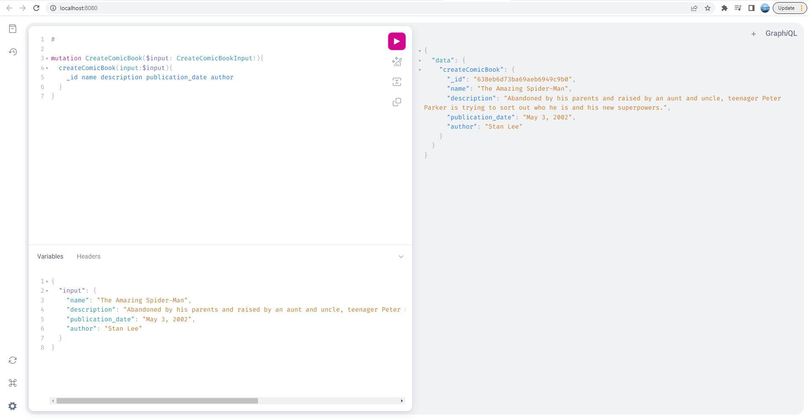
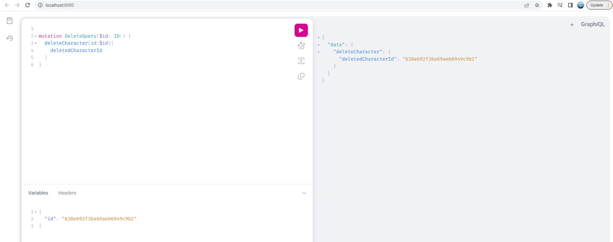

# Comic Book API

Inspired by comic books and Marvel, I used Golang, GraphQL, and MongoDB to create a CRUD API to keep track of comic books, its characters and authors, as well as the location and details of comic book stores all around the world.

In order to use the API, enter the command `go run server.go` in your terminal and then visit `http://localhost:8080/` to run your GraphQL queries.

Example queries:

